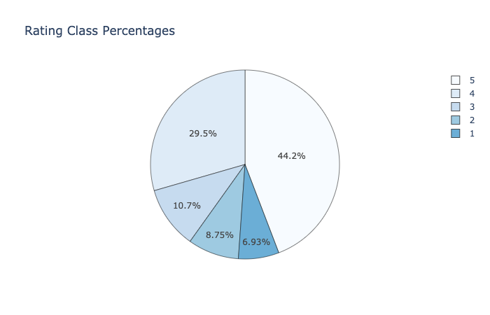

# Hotel Sentiment Analysis & NLP (TripAdvisor)

Applying NLP and Sentiment Analysis on hotels reviews from TripAdvisor. In the first part, we prepare and visualize the data (checking the classes distribution and percentages and word occurrences). After that, we clean our reviews by applying different text cleaning operations (lowercase..) and NLP methods.

## Dataset Distribution

The rating classes distribution (from 1 to 5) is given below. We notive that we have clearly imbalanced classes, the rating 5 is barely taking half the dataset.

